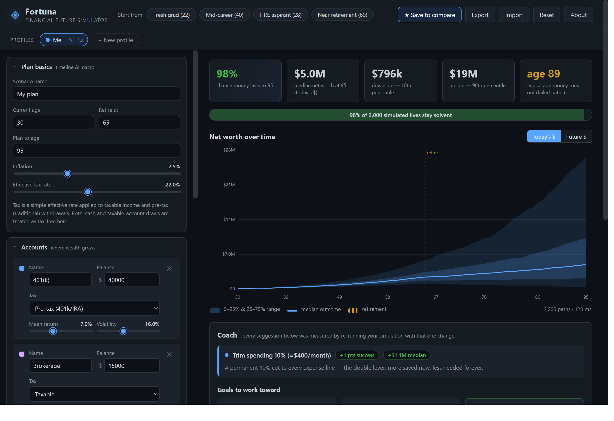

# ◈ Fortuna — Financial Future Simulator

**See your financial future as a *range*, not a guess.** Fortuna is a free, open-source desktop
app that builds a model of your financial life — income, spending, accounts, taxes, big plans —
and runs it through **thousands of simulated lifetimes** to show where you might actually land.
Then its Coach tells you, with numbers, what would improve the odds.

**100% private:** everything runs on your device. No account, no cloud, no telemetry.



## Download

**[⬇ Download the latest release](https://github.com/bpmcginley/Fortuna/releases/latest)** (Windows 10/11, 64-bit)

- `Fortuna_x.y.z_x64-setup.exe` — the installer (recommended)
- `fortuna.exe` — portable, no install needed

> **"Windows protected your PC"?** Fortuna is a new open-source app and isn't code-signed yet, so
> Windows SmartScreen may warn on first run. Click **More info → Run anyway**. The app is fully
> open source — you can audit every line here, or build it yourself from this repo.

**Or try the [live web demo](https://bpmcginley.github.io/Fortuna/)** — same app, right in the
browser. The desktop app is the full experience (native file dialogs, your data stays in one
place), but the demo is the fastest way to see what it does.

## What it does

- **Describe your life in plain English** — type *"I'm 27, a nurse making $82k, $20k in my
  401k, rent is $1,500/month, want to buy a house and retire by 60"* and Fortuna fills in your
  starting plan (free AI parse via Claude, with a fully on-device parser as automatic fallback).
  Every interpretation it makes is listed for you to review before anything is created.
- **Profiles** — plan multiple lives side by side. A quick-setup wizard (auto-opens on first
  launch) asks plain-language questions — age, career outlook, spending, investing style,
  home/kids plans — and builds a complete, editable plan.
- **Monte-Carlo projection** — your net worth over time as a percentile fan chart (5th–95th),
  the probability your money lasts, downside/upside outcomes, and the typical age failed paths
  run dry. 2,000 simulated lifetimes by default, up to 20,000.
- **The Coach** — a rule engine that diagnoses your plan and quantifies each suggestion by
  *re-running the simulation with that one change*: "retire two years later → +11 pts success
  chance". Plus progress-tracked goals (emergency fund, savings rate, milestones).
- **Fully customizable model** — accounts (taxable / 401k / Roth / cash) with per-account return
  and volatility, correlated through a shared market factor; income streams with real growth;
  expenses with start/end ages; contributions with employer match; one-off events (house,
  tuition, inheritance); three retirement withdrawal strategies; Gaussian, fat-tailed
  Student-t, lognormal or fixed return models; reproducible random seed.
- **Compare scenarios** — snapshot any plan and overlay it on the chart to see decisions
  side by side.
- **Year-by-year ledger** — income, tax, contributions, withdrawals and net worth for every
  age, in today's or future dollars.
- **Export / import** — plans are plain JSON files you own.

## How the model works

Each simulated life steps once per year. The engine runs a cash-flow waterfall — income minus
taxes, expenses, contributions, one-off events — saves any surplus, and covers shortfalls by
drawing accounts in tax-sensible order (cash → taxable → pre-tax → Roth, grossing up pre-tax
draws for tax). Every account then grows by a return drawn from its configured distribution,
correlated across accounts through a shared market factor. Percentile bands are computed over
all lifetimes in today's dollars. The simulation runs in a Web Worker (the UI never blocks) and
any run is reproducible from its seed.

## Building from source

```bash
npm install
npm run tauri:dev     # desktop app with hot reload
npm run tauri:build   # → src-tauri/target/release/fortuna.exe + NSIS installer
npm run dev           # browser dev mode (same UI, no desktop shell)
```

Prereqs: Node 20+, Rust (`winget install Rustlang.Rustup`), VS C++ Build Tools.
Releases are also built automatically by [GitHub Actions](.github/workflows/release.yml) on
version tags.

```
src/
  engine/     model types, seeded RNG, simulation, Coach rule engine, worker
  state/      scenario, presets, profiles + wizard, store, hooks
  components/ toolbar, profile bar, panels, fan chart, results, coach, ledger
src-tauri/    Tauri (Rust) desktop shell: window, security policy, installer
```

## Privacy & security

- All simulation runs locally; your plan data never leaves your device.
- **One optional exception, clearly labeled in-app:** the "describe your situation" box in the
  wizard sends *only the text you type there* to Fortuna's parser service
  ([`worker/`](worker/), a ~150-line Cloudflare Worker you can read) which forwards it to the
  Claude API and returns structured fields. No account, no identifiers, nothing stored. If the
  service is unreachable — or you disable it — an on-device parser is used instead.
- The desktop shell's only OS permissions are: file save/open dialogs (for the files *you*
  pick), and opening this repo's GitHub links in your browser. The full policy is
  ~40 lines: [`src-tauri/capabilities/default.json`](src-tauri/capabilities/default.json).
- Your data lives in the app's local storage and in JSON files you export.

## Caveats

Fortuna is an educational model, **not financial advice**. Real markets are not i.i.d. draws
from the distribution you pick; taxes, fees and behavior are simplified. Treat results as
"what these assumptions imply," never as predictions.

## License

[MIT](LICENSE) — free for everyone, forever.
